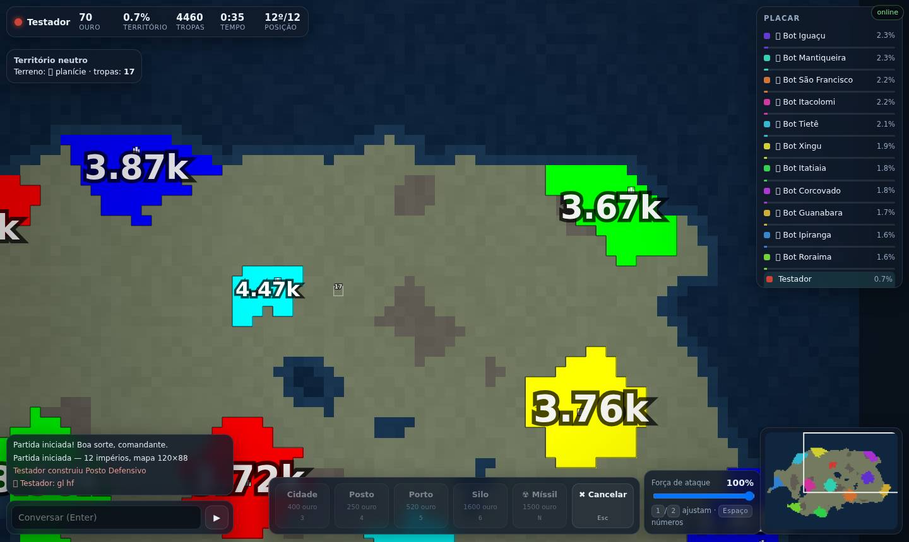
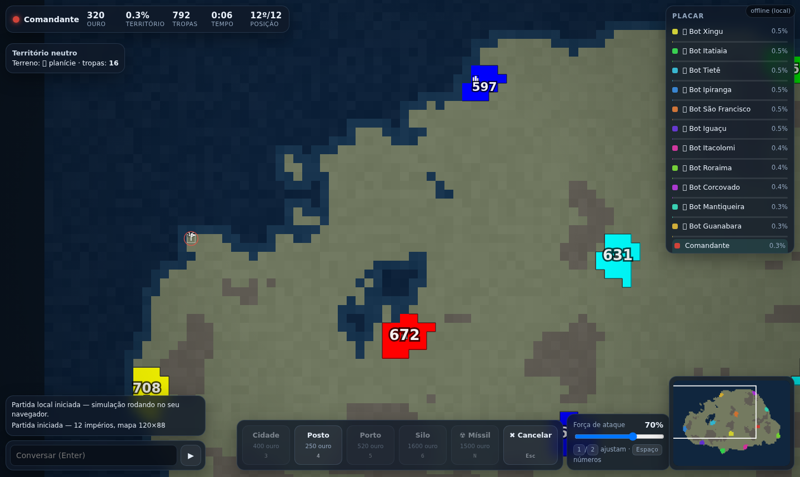

# LINHA DE FRENTE 🚩

RTS multiplayer de **conquista territorial** que roda no navegador — um jogo *original* no espírito do
gênero popularizado por Territorial.io / OpenFront / FrontWars: você começa com um punhado de tiles,
expande, constrói cidades e portos, concentra exércitos, lança mísseis e vence dominando **72% do mapa**
ou sendo o último império de pé.

> **Nota de originalidade (importante):** este projeto **não copia código, arte, mapas ou nome** de
> FrontWars/VexxusArts (software proprietário), nem de OpenFrontIO (AGPL-3.0) ou Territorial.io.
> Mecânicas e ideias de jogo não são protegidas por copyright; todo o código, balanceamento, arte
> vetorial e gerador de mapas aqui são autoria própria. Se você quiser redistribuir com outro nome,
> mantenha nomes/marcas de terceiros fora.



*Números centralizados por região + bandeirinha de ordem de expansão:*



---

## Rodando

```bash
npm install
npm run build      # bundle do cliente (public/bundle.js) + servidor (dist/server.cjs)
npm start          # http://localhost:3000  (bind 0.0.0.0)
```

| script | o que faz |
|---|---|
| `npm run build` | compila tudo (esbuild) |
| `npm run watch` | rebuild automático |
| `npm run dev` | build + sobe o servidor |
| `npm run typecheck` | `tsc --noEmit` estrito |
| `npm run simtest` | simulação headless só de bots (balanceamento/desempenho) |
| `npm test` | os 4 testes: sim, protocolo, navegador, carga |

Sem servidor por perto? O menu tem **“Jogar offline”** — a mesma simulação roda 100% no seu navegador.

---

## Como se joga

| ação | controle |
|---|---|
| mover câmera | `WASD`/setas, arrastar área vazia, arrastar no minimapa |
| zoom | roda do mouse, `Q`/`E` |
| centralizar no seu império | `C` |
| **expandir** | **clique num tile vazio**: vira ordem de expansão — suas tropas fluem e se espalham sozinhas até encostar em outro jogador (sem atacar); `Esc` cancela |
| **atacar** | **clique num tile inimigo na sua fronteira** (ataque direto) — ou selecione um tile seu e clique no alvo; arrastar a partir do seu território também ataca |
| transferir tropas | selecione um tile seu e clique em outro tile seu |
| selecionar / desmarcar | clique num tile seu (com outra origem selecionada, transfere) |
| construir | `3` cidade · `4` posto · `5` porto · `6` silo, depois clique num tile seu |
| míssil nuclear | `N`, clique no alvo (círculos = alcance/raio) |
| força do ataque | slider ou `1`/`2` |
| números de tropas | `Espaço` |
| chat | `Enter` |

**Números de tropas:** um único número **centralizado por região conectada** (não tile a tile),
crescendo em tempo real; o alvo da ordem de expansão ganha uma bandeirinha pulsante na cor do dono.

**Regras em uma linha:** tropas crescem por tile (teto maior em cidades), ouro vem de território +
cidades + portos, postos multiplicam a defesa, montanhas defendem mais, e a **morte súbita**
(a partir de 8 min) encolhe exércitos e anula fortificações para a partida sempre terminar.

---

## Arquitetura

```
src/
  shared/            ← simulacao autoritativa, usada pelo servidor E pelo modo offline
    constants.ts     ← TODO o balanceamento num lugar só
    mapgen.ts        ← continentes proceduralmente (value-noise + fbm, semente reproducivel)
    game.ts          ← tick, combate, construcoes, nucleares, vitoria, diffs de rede
    bot.ts           ← IA: ondas de agressao, ataques convergentes, fluxo BFS de reforco
                       (game.ts inclui a ordem de expansao: BFS do alvo + conquista só de neutro)
    codec.ts         ← base64 portatil + quantizacao de tropas (economiza banda)
    protocol.ts      ← contratos cliente<->servidor
  server/
    index.ts         ← HTTP estatico + WebSocket, salas/lobbies, loop 20Hz, broadcast 10Hz
  client/
    state.ts         ← espelho do mundo + BFS de caminho de ataque
    render.ts        ← Canvas 2D: camada base 1px/tile + upscale, fronteiras, obras, HUD de mapa
    main.ts          ← rede, input (mouse/teclado/toque), telas, modo offline
scripts/             ← testes (ver abaixo)
```

### Decisões que valem destaque

- **Servidor autoritativo, 20 Hz de simulação / 10 Hz de broadcast.** Cada cliente tem seu próprio
  “cursor de diff” (`collectChangesFor`), então quem entra no meio da partida recebe tudo e quem já
  está dentro recebe só o que mudou — com orçamento de mudanças por pacote e tropas **quantizadas**
  (passo 1 / 2 / 10 / 50) para a banda ficar pequena (~2 KB por broadcast em partida calma).
- **Uma simulação, dois mundos:** `Game` não toca em nada de Node nem de DOM, por isso o modo offline
  é literalmente o mesmo código do servidor rodando no navegador.
- **Render em camada base:** terreno+território viram um `ImageData` de `w×h` (1 px/tile) redesenhado
  só quando a posse de tiles muda (`world.rev`), e um único `drawImage` com upscale nearest-neighbor
  pinta o mapa — 60 fps com 10.560 tiles.
- **Morte súbita progressiva** (`SUDDEN_DEATH_AT`): sem ela, RTS de território puro empata para sempre
  (medido em simulação: 20 min de impasse). Com ela, toda partida termina.

### Protocolo (resumo)

```
cliente → servidor: hello | rooms | create | join | start | cmd(attack/build/nuke) | chat | leave | ping
servidor → cliente: welcome | rooms | joined | lobby | map | tick | over | chat | err | pong
```

`map` traz o terreno em base64 (1 byte/tile) + snapshot completo; `tick` traz diffs
`[índice, dono, tropas, obra]`, placar e eventos.

---

## Testes

| teste | comando | o que prova |
|---|---|---|
| Simulação | `npm run simtest -- 1200 12 4242` | bots jogam sozinhos: sem NaN, sem tile duplicado, eliminação e vitória acontecem, ~200-300× tempo real |
| Expansão | `node dist/expandtest.cjs 555 240` | ordem de expansão só toma neutro, **nunca** toma tile de outro jogador (para na fronteira) |
| Protocolo | `node scripts/wstest.mjs` | 13 checagens ponta-a-ponta: lobby, mapa, ataque, construção, rejeições, espectador, chat, ticks |
| Navegador | `node scripts/browser-test.mjs` | Chrome real (puppeteer): menu→lobby→partida, 60 fps, clique/arraste/construção/chat, modo offline; salva screenshots em `screens/` |
| Carga | `N=8 SECONDS=60 node scripts/soak.mjs` | 8 clientes agindo como humanos por 60 s: 0 quedas, ~10 ticks/s por cliente |

---

## Balanceamento

Tudo em `src/shared/constants.ts`: tetos de tropa, crescimento, custos, ouro por segundo, defesa,
alcance/raio/cooldown nuclear, tempo de morte súbita, % de vitória. O `simtest` é o seu laboratório:
mude um número, rode 20 min de partida em ~5 s e veja o placar.

## Roadmap (v0.2+)

- [ ] **Alianças e diplomacia**: pedidos/aceites, traição com debuff, comércio entre portos aliados
- [ ] **Guerra naval**: navios de guerra, interceptação de rotas comerciais, bombardeio costeiro
- [ ] Reconexão (reatachar à partida pelo token da sessão) e espectadores com câmera livre
- [ ] Contas, ranking persistente e clãs; torneios
- [ ] Protocolo binário (ArrayBuffer) + delta de fronteiras para partidas com centenas de jogadores
- [ ] Mais mapas (ilhas, anel, deserto) e editor de mapa no lobby
